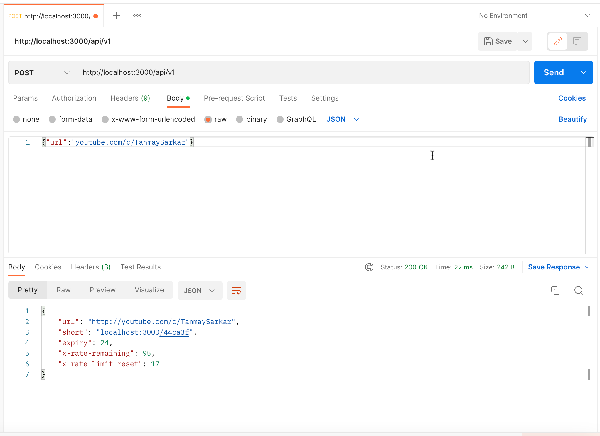
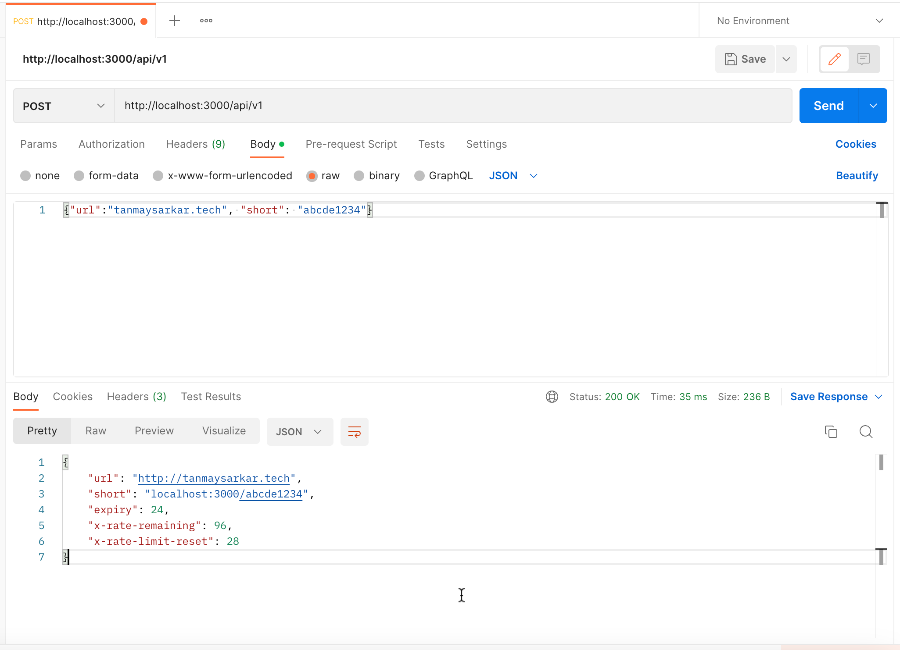

## URL Shortener Service 🩳
#### Built using Golang, Redis, Docker, Docker Compose.

### Description 📝
This is a simple URL shortener service that uses Redis as a database. It is built using Golang and Docker. It is also deployed on somewhere.


### How to run 🏃‍♂️
1. Clone the repository
```zsh
$ git clone https://github.com/sarkartanmay393/URL-Shortener-Go.git
```
2. Run `docker compose up` in the root directory
```zsh
$ docker compose up
```

### How to use 🤔
1. Send a POST request to `localhost:3000/api/v1` with the following raw body
```json
{
    "url": "www.tanmaysarkar.tech"
}
```
> You may have to set Content-Type to `application/json` in the header.

2. You will get a response like this
```json
{
  "url": "http://tanmaysarkar.tech",
  "short": "localhost:3000/abcde1234",
  "expiry": 24,
  "x-rate-remaining": 96,
  "x-rate-limit-reset": 28
}
```
3. You can use the `short` URL to redirect to the original URL.

### Test Screenshots 📸


<br>


### How to Contribute 🤝

1. Fork the repository
2. Clone the repository
```zsh
git clone https://github.com/sarkartanmay393/URL-Shortener-Go.git
```
3. Create a new branch
```zsh
git checkout -b <branch-name>
```
4. Make changes and commit
```zsh
git add . && git commit -s -m "New feature added"
```
5. Push the changes
```zsh
git push origin <branch-name>
```
6. Create a pull request and wait for it to be merged 🎉

### Connect with me 🖇️

· [Twitter/sarkartanmay393](https://www.twitter.com/sarkartanmay393) 🐦